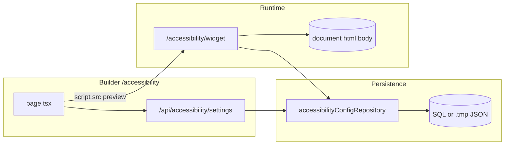

# Accessibility: roadmap vs build — audit report

**Generated from the frozen roadmap and Phase A+B spec vs current code.** Read-only findings; not a commitment to implement gaps.

## Scope and method

- **Sources:** Frozen roadmap (Phases A–H + v1 bar), Phase A+B spec (panel pattern, ARIA, keyboard, persistence expectations), and current code under `app/accessibility/**`, `app/api/accessibility/**`, `lib/accessibilityConfigRepository.ts`, plus repo-wide references to the widget and layout hooks.
- **Not performed:** Live keyboard/SR testing, production network verification, or Shopify theme embedding checks. Findings below are **static code + doc traceability**.

---

## Executive summary

The **runtime widget** in [`app/accessibility/widget/route.ts`](../app/accessibility/widget/route.ts) implements a **large subset of Phase A, Phase B, and parts of Phase C**, ahead of the written “A then B then C” gate: exclusives are already **custom `radiogroup` + roving `tabIndex`** (not Phase-A `<select>`), switches use **`role="switch"`**, live region + `announce()` exist, panel is **`role="region"`** without `aria-modal`, `Esc` is on the panel, initial focus goes to **Close**, close returns focus to launcher, and jump commands exist.

**Gaps vs the written plan** are concentrated in: **D (schema/versioning, session vs saved split, reset levels)**, **E (scoped transforms, exclusions, image policy)**, **F (preset transparency, undo, help, skip-to-main)**, **G (landmark map, collision, mobile polish)**, **H (search, debug API, etc.)**, and several **spec details** (named `section` regions in the panel, `aria-describedby` targeting, motion preference **UI**).

The **builder** ([`app/accessibility/page.tsx`](../app/accessibility/page.tsx)) is feature-rich (settings, export, law watch, monthly report, preview) but has **UX/a11y debt**: a full top `<nav className={styles.tabBar}>` is **hidden** via [`.page > .tabBar { display: none }`](../app/accessibility/page.module.css), so **scope + duplicate Publish** live in the DOM but are not visible; working navigation is **`PremiumSegmentedNav`** only ([`components/premium-segmented-nav/PremiumSegmentedNav.tsx`](../components/premium-segmented-nav/PremiumSegmentedNav.tsx)), which is **only imported here** (no leak to other app routes).

**Cross-page impact** inside the Next app is **narrow and intentional**: global layout tweaks apply **only** when the accessibility layout wrapper is present (see below). **The widget’s host-page CSS/attrs are aggressive by design** when the script runs on any site (including your app during preview).

---

## Phase-by-phase: plan vs implementation

### Phase A — Accessibility foundation

| Item | Spec / roadmap | Observed in code | Verdict |
|------|----------------|------------------|---------|
| A1 Launcher ARIA | `aria-expanded`, `aria-controls`, no `aria-haspopup`, decorative icon | [`route.ts`](../app/accessibility/widget/route.ts): launcher `aria-expanded`, `aria-controls` → `ca-assist-panel`, glyph `aria-hidden` | **Met** |
| A2 Panel | Non-modal `region`, no trap, focus return | `role="region"`, no `aria-modal`; `setOpen` focuses close on open, launcher on close; `document` click closes | **Met** |
| A3 Section structure | Regions / headings / grouped controls | Panel uses `h2` titles via `makeSectionTitle`; groups are **`div.ca-assist-sec-group`** — **no** native `<section>` or `role="region"` per block (spec §3.5) | **Partial** |
| A4 Tab order | Through panel and page | No trap in code path; rerender restores focus by `data-carbon-key` | **Likely met** (unverified) |
| A5 Live region | `role="status"`, polite, atomic | `live` node: `role="status"`, `aria-live="polite"`, `aria-atomic="true"`, `announce()` with dedup | **Met** |
| A6 Visible focus | `:focus-visible` on interactives | Present in injected widget CSS strings (scoped to `.ca-assist-root` / panel) | **Met** for widget chrome |
| A7 Escape | Only when focus in panel | `panel.addEventListener("keydown", Escape)` → `setOpen(false)` | **Met** |

### Phase B — Control semantics

| Item | Spec / roadmap | Observed | Verdict |
|------|----------------|----------|---------|
| B1 Switches / radios | `role="switch"`; radiogroup for exclusives | `makeAction` → `role="switch"` + `aria-checked`; `makeRadioGroup` → `role="radiogroup"` / `role="radio"` | **Met** |
| B2 No cycle-only exclusives | Visible choices | All exclusives use segmented radios, not `<select>` | **Met** (actually **beyond** Phase-A spec which allowed `<select>` until B) |
| B3 Keyboard map | Arrows, Home/End, Space; comment in file | File header comment references keyboard; radio `keydown` implements arrows, Home/End, Space | **Met** |
| B4 Value to AT | Group + value | Radios update `aria-checked` and `tabIndex`; switches use `aria-checked` | **Met** |
| B5 Commands | Announced results | Text scale uses delayed `announce` for percent; jumps announce ok/none | **Met** |

### Phase C — Motion, touch, focus enhancement

| Item | Roadmap | Observed | Verdict |
|------|---------|----------|---------|
| C1 PRM / `motionPreference` | `system` \| `reduce` \| `allow`, persisted; `shouldMinimizeMotion()`; shell class; PRM listener | `effectiveReducedMotion`, `shouldMinimizeMotion`, `syncWidgetMotionClass` + `ca-assist-reduce-motion`; `motionPreference` **saved in `saveState`**; `matchMedia` listener when `system` | **Logic partial** — **no panel control** to set `motionPreference` (only default `system` + hydration) |
| C2 Touch targets ≥ 44px | Config | Not audited pixel-by-pixel in CSS; launcher size is configurable (60–96px) | **Unknown / partial** |
| C3 Motion-safe panel | Open/close respects PRM | Display toggle + reduce-motion class | **Partial** |
| C4 Enhanced focus mode | Page-level focus halo toggle | **Not found** as a dedicated feature; `highlightLinks` outlines links only | **Missing** |
| C5 System contrast hints | Optional non-blocking tips | **Not found** | **Missing** |

**Note:** Roadmap **defers draggable launcher**; code **implements FAB drag + `localStorage` position** — **doc and product disagree** (implementation is *more* than deferred scope).

### Phase D — State architecture

| Item | Roadmap | Observed | Verdict |
|------|---------|----------|---------|
| D1 Session vs saved | Clear split | Single merged `state` blob to `localStorage` (`carbonA11yPrefs::…`); no separate session tool store | **Missing** |
| D2 Precedence documented | In code comments | Precedence not documented as specified | **Missing** |
| D3 Per-feature persistence flags | Config-driven | Feature flags exist in **server config**; not per-tool session/persist split | **Partial** |
| D4 Reset levels | Multiple reset depths + confirm | Reset/`clear` profile path; no staged reset UX | **Missing** |
| D5 Schema `v` + migration | Version + merge + corrupt fallback | `hydrateState` uses `JSON.parse` + `Object.assign`; **no `v` field** | **Missing** |

### Phase E — Site-safe visual transforms

| Item | Roadmap | Observed | Verdict |
|------|---------|----------|---------|
| E1 Scoped contrast | Document `html` vs `main` | [`renderGlobalStyles`](../app/accessibility/widget/route.ts) applies **`html,body`**, `:root{font-size}`, broad selectors (`p,li,button,…`, `html{filter:…}`) | **Not met** (intentionally global for embed; **not** “site-safe scoped” per E1) |
| E2 Invert protection | Advanced gating | Invert is a normal contrast option | **Partial / missing** vs E2 |
| E3 Exclusions | `data-carbon-a11y-exclude` + `ignoreSelectors` | **Not found** in `route.ts` | **Missing** |
| E4 Image modes | Functional media preserved | `hideImages` uses `visibility:hidden` on `img,svg,picture,video,canvas` — **can hide functional media** | **Risk vs E4** |

### Phase F — Presets, help, quick actions

| Item | Roadmap | Observed | Verdict |
|------|---------|----------|---------|
| F1 Preset summaries | List what changes | **Not in panel** | **Missing** |
| F2 Undo / restore | Session stack | **Not found** | **Missing** |
| F3 Help copy | Expandable help | Hints only on some toggles (e.g. pause animations) | **Partial** |
| F4 i18n completeness | RTL review | EN/ES/PT-BR/HE strings + `syncDocumentLangDir` / Hebrew shell class + locale fonts | **Strong** |
| F5 Skip to main | Baseline | Only **Jump to headings / Jump to links** | **Partial** (no skip-to-main) |

### Phase G — Launcher and navigation polish

| Item | Roadmap | Observed | Verdict |
|------|---------|----------|---------|
| G1 Landmarks map | main, nav, footer, search | **Not implemented** (only heading/link selectors) | **Missing** |
| G2 Collision handling | Offsets vs chat/cookie bars | Fixed FAB + clamp; **no** theme-specific collision config | **Missing** |
| G3 Mobile placement | Safe areas | Clamp to viewport margins; **no** `safe-area-inset` logic spotted | **Partial** |

### Phase H — Product extras

- **H1–H6:** No in-panel search, no documented debug query mode, no public `open/close` API — **largely not implemented** (consistent with “late”).

### “Finished v1” bar (roadmap one-liner)

- **Semantically correct / keyboard / announces / motion (partial) / persistence (partial) / visual overrides without breaking site:** **Partially** satisfied on a **consumer storefront** (by design, global CSS may break some layouts). For **your app**, preview is opt-in and cleaned on unmount.

---

## Builder page: wiring and consistency

- **Config load/save:** [`/api/accessibility/settings`](../app/api/accessibility/settings/route.ts) + scope query param; aligned with widget [`loadAccessibilityWidgetConfig`](../lib/accessibilityConfigRepository.ts).
- **Preview:** Injects `<script src="/accessibility/widget?scope=…">`; teardown removes `#carbon-a11y-widget`, `#carbon-a11y-style`, guide, mask, script ([`removeRuntimeWidgetFromPage`](../app/accessibility/page.tsx)).
- **Segmented nav:** `activateTopTab` scrolls to `#snippets`, `#config-console`, `#law-watch-rail`, `#widget-surface` — **IDs exist** in page; **functional**.
- **Hidden top bar:** Entire first `<nav className={styles.tabBar}>` hidden by CSS — **dead/duplicate** relative to `PremiumSegmentedNav` (duplicate Publish, non-functional tab buttons). This is **builder debt**, not a runtime gap.
- **Install snippets:** Hard-coded `https://app.shopcarbon.com/accessibility/widget` in snippet helpers — **correct for prod**; local dev uses relative `/accessibility/widget`.

---

## Cross-app leakage and host impact (did accessibility work hurt other pages?)

### Inside the Next.js app (carbon-gen)

1. **[`app/globals.css`](../app/globals.css)** — `body:has(.accessibility-standalone-route) …` rules hide certain shell chrome (integration/chat/right rail, top background) and adjust content padding. These selectors apply **only** when [`app/accessibility/layout.tsx`](../app/accessibility/layout.tsx) wraps children in `.accessibility-standalone-route`. **Other routes do not use that class → no effect.** Same file uses an analogous pattern for **collection mapping** (separate class) — independent.

2. **[`components/workspace-shell.tsx`](../components/workspace-shell.tsx)** — nav item `{ href: "/accessibility", label: "Accessibility" }`. **Normal link**; no shared state with other pages.

3. **`PremiumSegmentedNav`** — **only** referenced from [`app/accessibility/page.tsx`](../app/accessibility/page.tsx). **No leakage.**

4. **API routes** under `app/api/accessibility/*` — isolated HTTP surface; other pages do not import them unless they call fetch (grep shows usage concentrated on the accessibility page).

**Conclusion (in-app):** No evidence that accessibility **layout/CSS** or **shared components** corrupt non-accessibility routes. The only “global” app CSS tied to accessibility is **gated by `:has(.accessibility-standalone-route)`**.

### When the widget script runs (preview on `/accessibility` or embed on a store)

These are **by design** for a host-page overlay, but they are the main **externalities**:

1. **`#carbon-a11y-style`:** Injects **document-wide** rules (`:root` font-size, `html,body` colors, `html{filter}`, `*` font-family/cursor, animation kills, link outlines, hide media, etc.) — affects **the entire document**, including WorkspaceShell, while preview is active.

2. **`syncDocumentLangDir`:** Sets `document.documentElement` **`lang` and `dir`** from widget language (e.g. Hebrew → `dir="rtl"` on `<html>`). **Whole app chrome** follows while active.

3. **Global `mousemove` listener** on `document` for reading guide/mask — active whenever the script is loaded.

4. **Globals on `window`:** e.g. `__carbonA11yLoaded`, `__carbonA11yTrackTimes`, `__carbonA11yPrmBound`, `__caA11yLocaleFonts` — low collision risk but namespace pollution.

5. **Usage tracking:** `sendBeacon` / `fetch` to **`/api/accessibility/usage`** on the **widget script’s origin** (derived from embed URL) — correct for `app.shopcarbon.com`; third-party origins would POST to your app if CORS allows (implementation detail not fully traced here).

**Conclusion (widget-on-host):** No “accidental” leak into unrelated **routes** without the script; **during preview on `/accessibility`**, the **whole shell** is a valid host and **will** be restyled if the user enables strong modes. That is **expected** for testing the embed, not a silent bug on `/dashboard` unless the script is also injected globally (it is not in repo).

---

## Mermaid: data flow (high level)

---

## Risk register (report-only)

| Risk | Severity | Notes |
|------|----------|--------|
| Global CSS + `html` `filter` stacking | Medium | Multiple modes write `html{filter:…}`; last rule wins — unpredictable combos |
| `hideImages` hides `video` | Medium | May break product video UX on storefronts |
| `syncDocumentLangDir` on builder | Low–Med | RTL/lang on full app during preview |
| No schema `v` / corrupt storage | Low | Parse failure silently aborts hydrate; user may see defaults without explain |
| Roadmap vs code (Phase C UI, draggable FAB) | Low | Planning docs understate or overstate shipped behavior |

---

## Suggested verification checklist (for you or QA later)

- Keyboard-only: open/close, all radios, all switches, jumps, reset, language change.
- NVDA/VoiceOver: announcements on preset, toggles, exclusives, jumps.
- With preview open on `/accessibility`: enable invert + saturation + high contrast and confirm builder still usable.
- Embed on a **Shopify preview** theme: confirm no double-load of script, storage key scope, and usage beacon target.

---

## Related docs

- [accessibility-widget-roadmap.md](./accessibility-widget-roadmap.md)
- [accessibility-widget-phase-a-b-spec.md](./accessibility-widget-phase-a-b-spec.md)

*This file is the persisted audit deliverable. It does not imply upcoming code changes.*
