# UserWay → Carbon comparison (every UserWay feature)

**Generated:** 2026-03-26T08:08:57.035Z  
**PDP:** [Gyda product](https://shopcarbon.com/products/gyda-2-piece-streetwear-set-72) (both widgets present in source runs).  
**Assets:** `userway-pdp/` = UserWay shots, `carbon-pdp/` = Carbon Assist shots (copies).

## Why “similar feature ≠ same UX or outcome”

| Topic | UserWay | Carbon Assist |
|-------|---------|----------------|
| **Controls** | Many features are **toggles or cycles** (one control, multiple presses). | Mostly **explicit values** (radios, separate tiles) — **predictable state** from the label. |
| **Contrast** | **Contrast +** walks a vendor-defined sequence. | **Named modes**: none, dark, light, invert, smart (+ optional **high contrast** tile). |
| **Typography / layout** | **Enable** APIs often **advance** internal state. | **Spacing / line / align / saturation** each have **listed options**. |
| **Bundling** | Dyslexia = **font** focus. | **Dyslexia preset** bundles font + spacing + line + align. |
| **Extras** | **TTS**, **inline dictionary**, **landmarks** navigation. | **No** TTS/dictionary; **no** landmarks button (headings + links only). |
| **Delivery** | Third-party **iframe** + **window.UserWay** API. | First-party **shadow root** on host **#carbon-a11y-widget**. |

Screenshots show **one moment in time** on one theme; they **do not** prove WCAG conformance or identical remediation.

---

## Pairing table (UserWay file → closest Carbon)

### Baseline (no widget changes yet)

| UserWay (this feature) | Carbon Assist (closest) |
|--------------------------|---------------------------|
| **UserWay:** 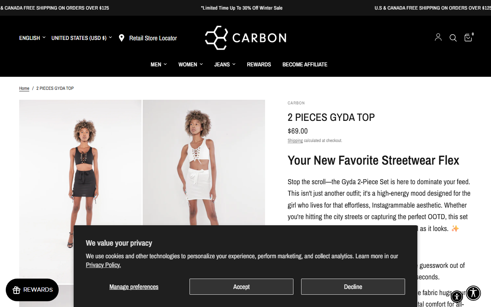 | **Carbon:**  |

**Similar ≠ same:** Same PDP before applying either tool. Carbon launcher may still be visible; states should match ‘clean’ intent.

---

### Menu open

| UserWay (this feature) | Carbon Assist (closest) |
|--------------------------|---------------------------|
| **UserWay:**  | **Carbon:**  |

**Similar ≠ same:** UserWay: **iframe** menu. Carbon: **shadow DOM** panel. Different chrome, focus model, and density — similar *goal* (pick options), not same UX.

---

### Contrast + — step 1 (UserWay cycle)

| UserWay (this feature) | Carbon Assist (closest) |
|--------------------------|---------------------------|
| **UserWay:**  | **Carbon:** 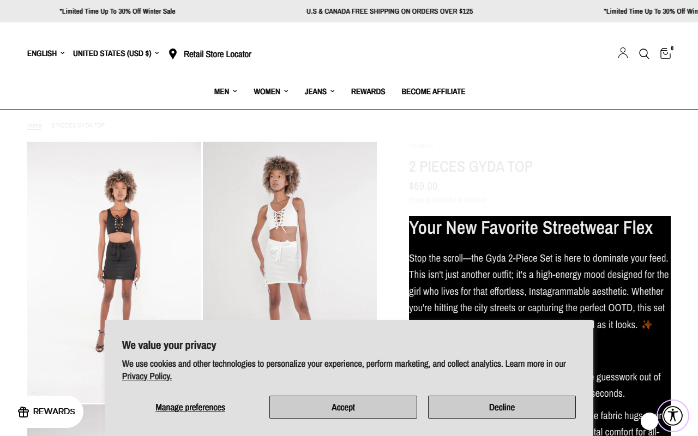 |

**Similar ≠ same:** UserWay **one button cycles** modes; step 1 is not guaranteed to equal Carbon **Invert**. Carbon sets an explicit `contrastMode` radio — predictable, labeled outcome.

---

### Contrast + — step 2 vs Carbon dark

| UserWay (this feature) | Carbon Assist (closest) |
|--------------------------|---------------------------|
| **UserWay:**  | **Carbon:** 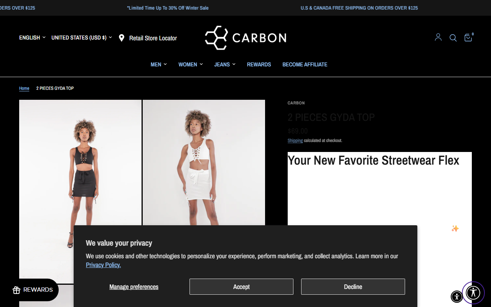 |

**Similar ≠ same:** Ordinal mapping only. UserWay’s 2nd mode ≠ Carbon **dark** unless their engine matches; **outcome can diverge** on the same DOM.

---

### Contrast + — step 3 vs Carbon light

| UserWay (this feature) | Carbon Assist (closest) |
|--------------------------|---------------------------|
| **UserWay:** 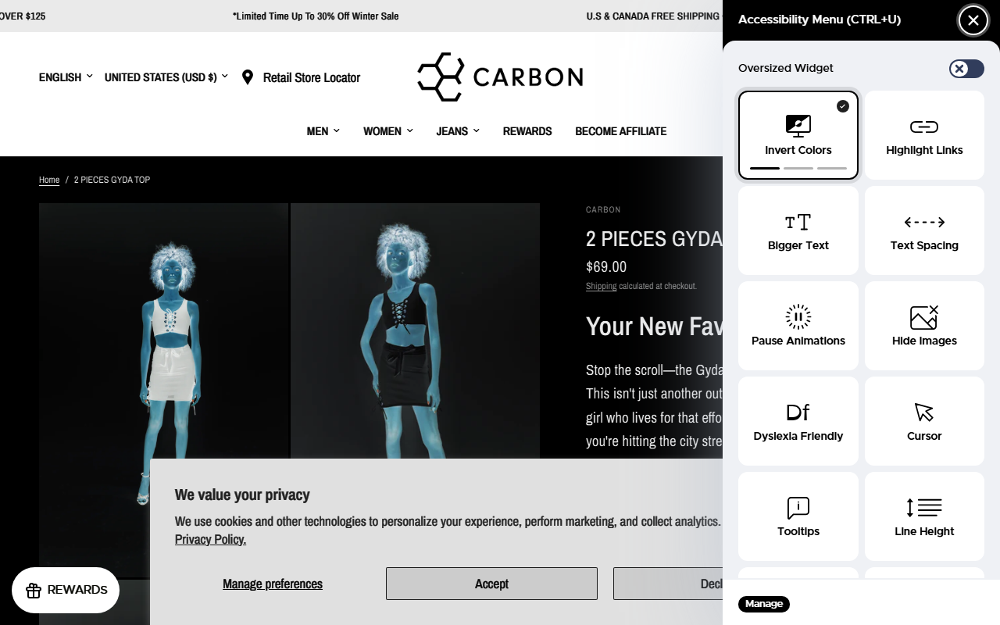 | **Carbon:** 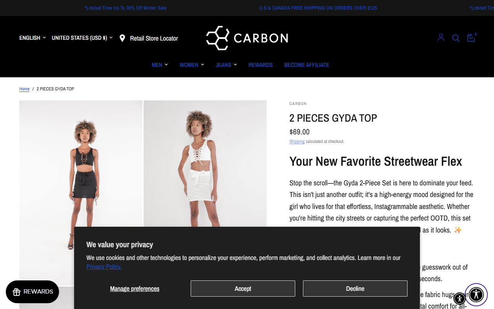 |

**Similar ≠ same:** Same caveat: **cycle position** vs **named mode** — different mental model and possibly different filters/CSS.

---

### UserWay `contrastEnable` vs Carbon invert

| UserWay (this feature) | Carbon Assist (closest) |
|--------------------------|---------------------------|
| **UserWay:**  | **Carbon:**  |

**Similar ≠ same:** Closest semantic pair. Still: vendor filter stack vs Carbon `contrastMode==='invert'` in `route.ts` — **not pixel-identical**.

---

### Smart contrast

| UserWay (this feature) | Carbon Assist (closest) |
|--------------------------|---------------------------|
| **UserWay:** 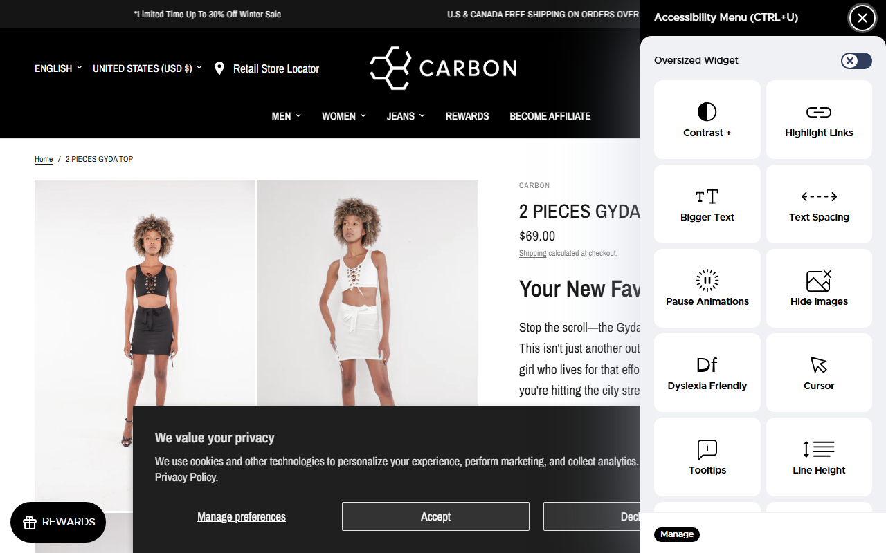 | **Carbon:** 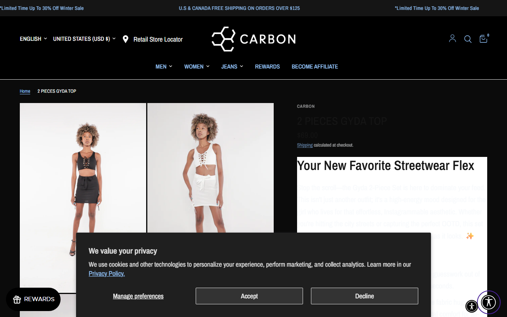 |

**Similar ≠ same:** Both target ‘smart’ contrast, but **implementation and triggers** differ (UserWay API vs Carbon `contrastMode: smart`).

---

### Larger text

| UserWay (this feature) | Carbon Assist (closest) |
|--------------------------|---------------------------|
| **UserWay:**  | **Carbon:** 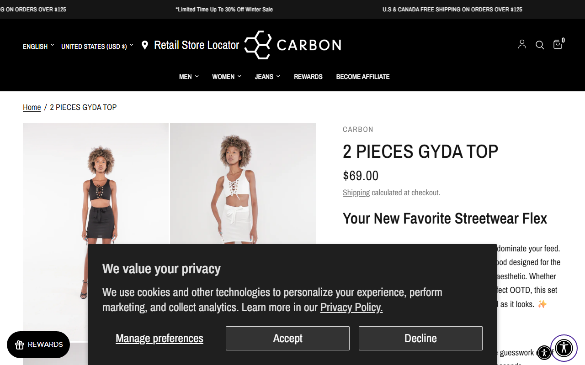 |

**Similar ≠ same:** Carbon: **discrete steps** (+5 in test). UserWay: **bigTextEnable** toggle/cycle — **different step sizes** and max scale.

---

### Legible / readable font

| UserWay (this feature) | Carbon Assist (closest) |
|--------------------------|---------------------------|
| **UserWay:** 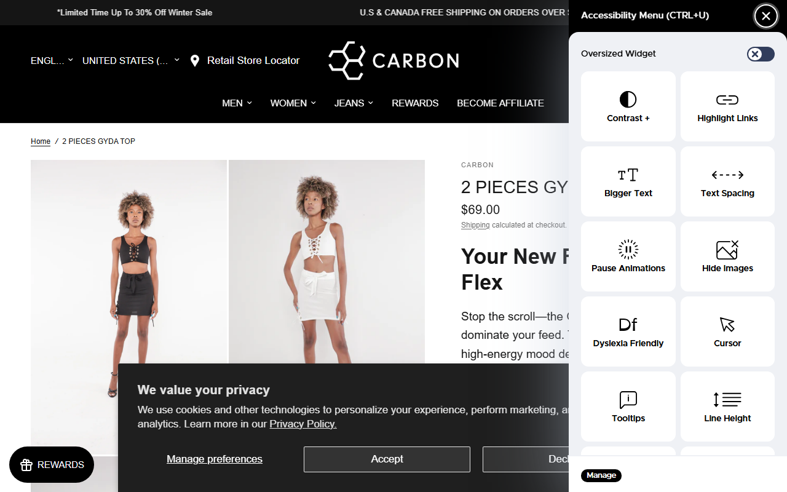 | **Carbon:**  |

**Similar ≠ same:** Same idea (font swap). **Font choice and fallbacks** differ by product; verify readability on your theme for both.

---

### Text spacing

| UserWay (this feature) | Carbon Assist (closest) |
|--------------------------|---------------------------|
| **UserWay:**  | **Carbon:**  |

**Similar ≠ same:** Carbon: **explicit** normal | moderate | heavy. UserWay: **textSpacingEnable** typically **cycles** — one PNG is one stop, not the full matrix.

---

### Line height

| UserWay (this feature) | Carbon Assist (closest) |
|--------------------------|---------------------------|
| **UserWay:**  | **Carbon:**  |

**Similar ≠ same:** Carbon: **normal | relaxed | loose** radios. UserWay: **cycles** through states — **not the same labels** per click.

---

### Text alignment

| UserWay (this feature) | Carbon Assist (closest) |
|--------------------------|---------------------------|
| **UserWay:** 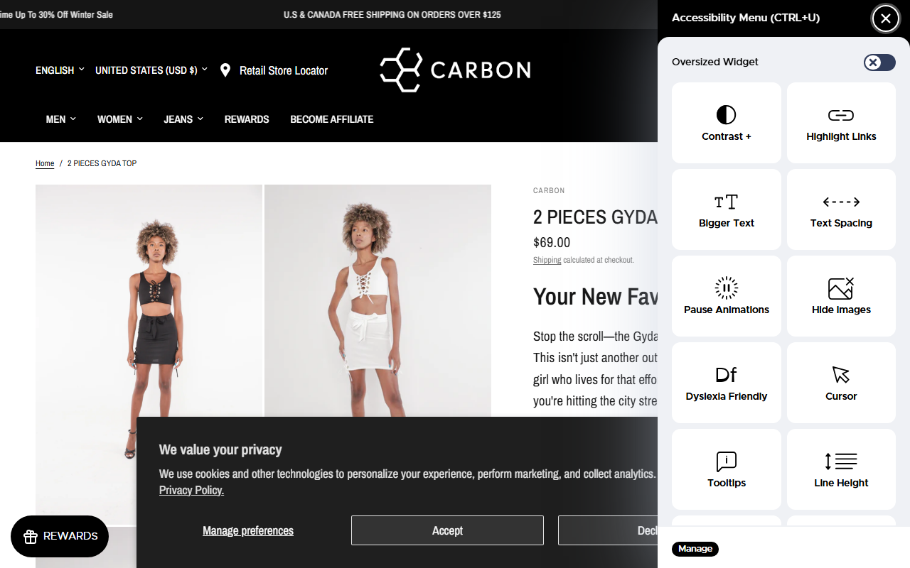 | **Carbon:**  |

**Similar ≠ same:** Carbon: **default | left | center | justify**. UserWay: **align cycle** — mapping uses **left** as one comparable stop.

---

### Saturation

| UserWay (this feature) | Carbon Assist (closest) |
|--------------------------|---------------------------|
| **UserWay:** 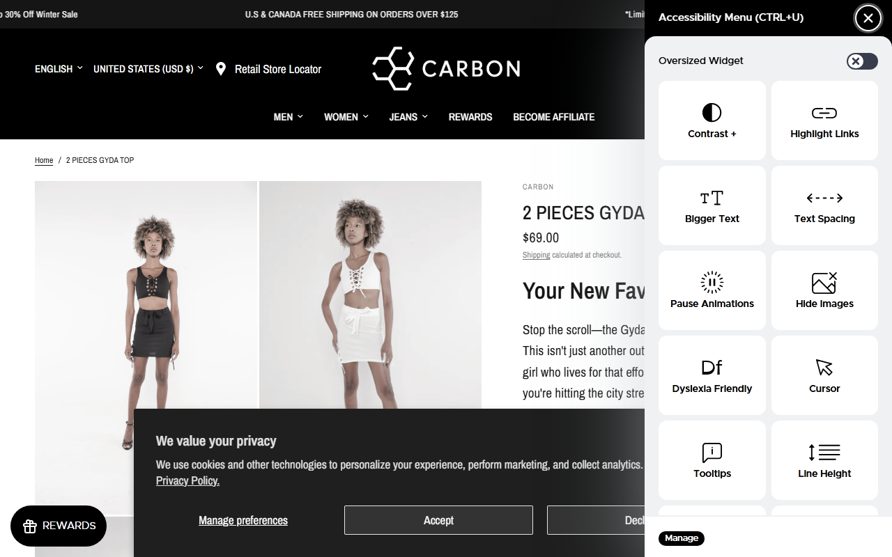 | **Carbon:** 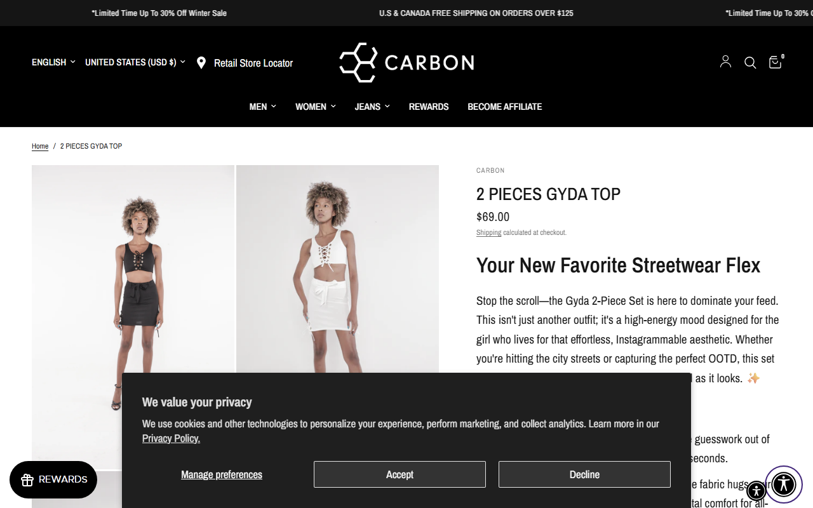 |

**Similar ≠ same:** Carbon: **normal | low | high | mono** as separate values. UserWay: **saturation cycle** — screenshot is one arbitrary stop vs Carbon **low**.

---

### Dyslexia-friendly

| UserWay (this feature) | Carbon Assist (closest) |
|--------------------------|---------------------------|
| **UserWay:**  | **Carbon:** 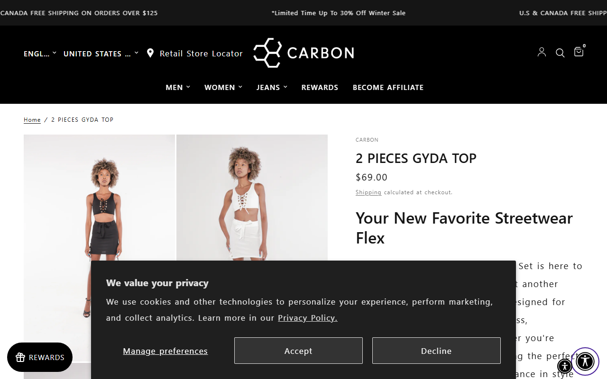 |

**Similar ≠ same:** Carbon **preset** also changes spacing + line height + align. UserWay **dyslexiaFont** is narrower — **same label, different bundle**.

---

### Hide images

| UserWay (this feature) | Carbon Assist (closest) |
|--------------------------|---------------------------|
| **UserWay:**  | **Carbon:** 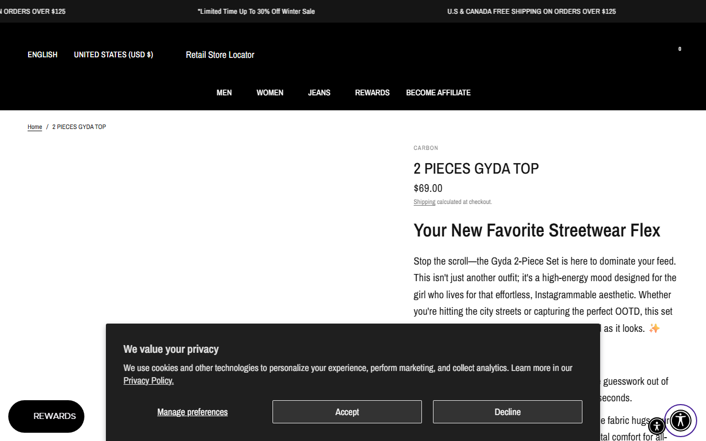 |

**Similar ≠ same:** Same feature intent. **How** images are hidden (selectors, lazy-load) can differ — check cart/gallery edge cases.

---

### Highlight links

| UserWay (this feature) | Carbon Assist (closest) |
|--------------------------|---------------------------|
| **UserWay:**  | **Carbon:**  |

**Similar ≠ same:** Both outline/emphasize links; **styles and persistence** may differ.

---

### Pause / stop animation

| UserWay (this feature) | Carbon Assist (closest) |
|--------------------------|---------------------------|
| **UserWay:**  | **Carbon:**  |

**Similar ≠ same:** Carbon `pauseAnimations` vs UserWay `stopAnimationEnable` — similar; **what counts as animation** is product-specific.

---

### Big cursor

| UserWay (this feature) | Carbon Assist (closest) |
|--------------------------|---------------------------|
| **UserWay:**  | **Carbon:** 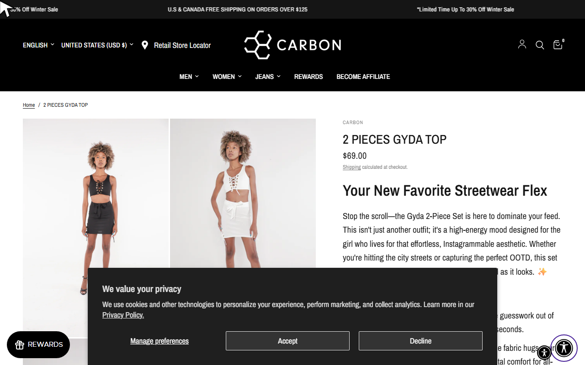 |

**Similar ≠ same:** Both enlarge pointer; **cursor asset and hit area** differ.

---

### Tooltips

| UserWay (this feature) | Carbon Assist (closest) |
|--------------------------|---------------------------|
| **UserWay:** 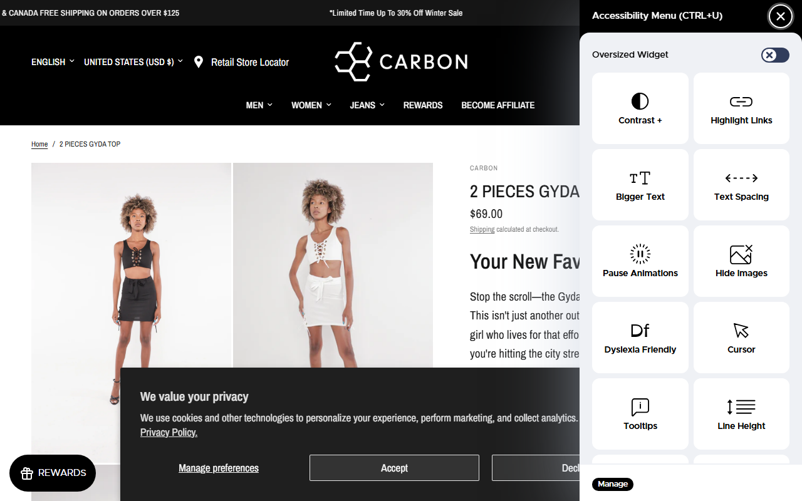 | **Carbon:**  |

**Similar ≠ same:** Carbon: **migrates `title`** to custom overlay. UserWay: vendor tooltip behavior — **coverage of `aria-label` / custom tooltips** differs.

---

### Reading guide

| UserWay (this feature) | Carbon Assist (closest) |
|--------------------------|---------------------------|
| **UserWay:**  | **Carbon:** 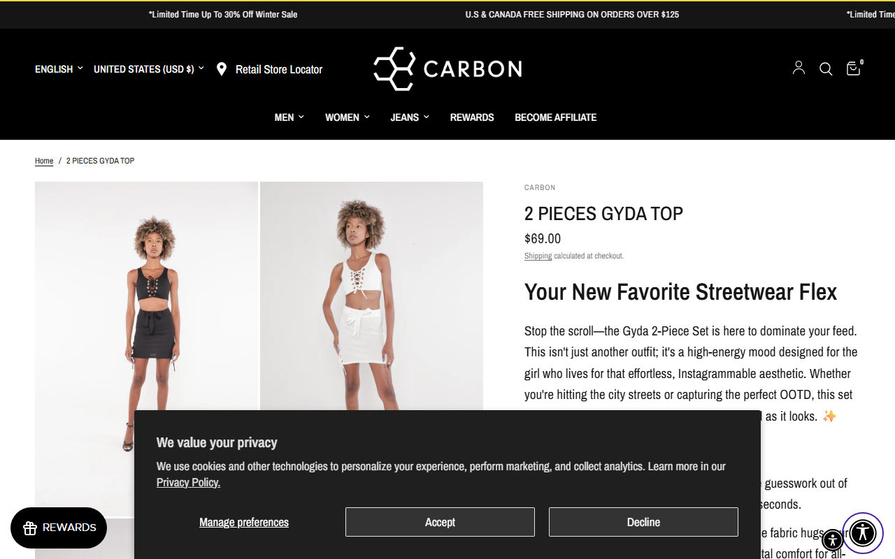 |

**Similar ≠ same:** Same pattern (horizontal line); **positioning and keyboard** behavior may differ.

---

### Reading mask

| UserWay (this feature) | Carbon Assist (closest) |
|--------------------------|---------------------------|
| **UserWay:**  | **Carbon:**  |

**Similar ≠ same:** Same idea; **mask geometry** and interaction differ.

---

### Read page (text-to-speech)

| UserWay (this feature) | Carbon Assist (closest) |
|--------------------------|---------------------------|
| **UserWay:**  | **Carbon:** _no direct equivalent in Assist widget_ |

**Similar ≠ same:** **No Carbon equivalent** in the Assist widget. Carbon does not ship this as a built-in control — UserWay-only capability in this comparison.

---

### Inline dictionary

| UserWay (this feature) | Carbon Assist (closest) |
|--------------------------|---------------------------|
| **UserWay:**  | **Carbon:** _no direct equivalent in Assist widget_ |

**Similar ≠ same:** **No Carbon equivalent** — UserWay-only.

---

### Structure: headings

| UserWay (this feature) | Carbon Assist (closest) |
|--------------------------|---------------------------|
| **UserWay:**  | **Carbon:**  |

**Similar ≠ same:** Both jump to heading-like content. **Selector lists and focus targets** may differ (Carbon uses `h1–h6` + `[role=heading]`).

---

### Structure: landmarks

| UserWay (this feature) | Carbon Assist (closest) |
|--------------------------|---------------------------|
| **UserWay:** 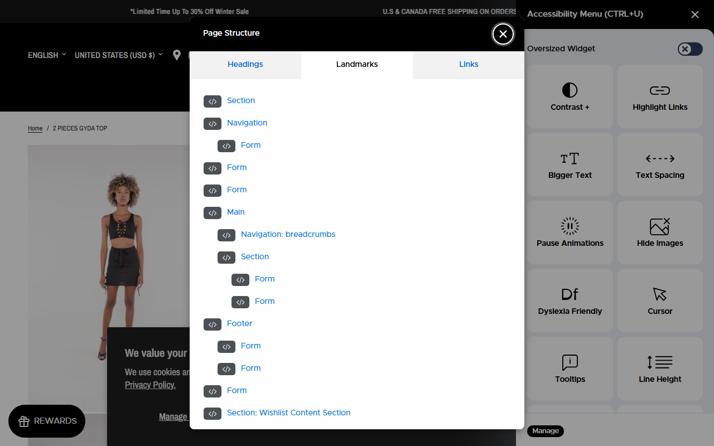 | **Carbon:** _no direct equivalent in Assist widget_ |

**Similar ≠ same:** **No dedicated Carbon control** in the shipped menu (headings + links only). Closest manual approach would be browser/SR landmarks, not a matching button.

---

### Structure: links

| UserWay (this feature) | Carbon Assist (closest) |
|--------------------------|---------------------------|
| **UserWay:** 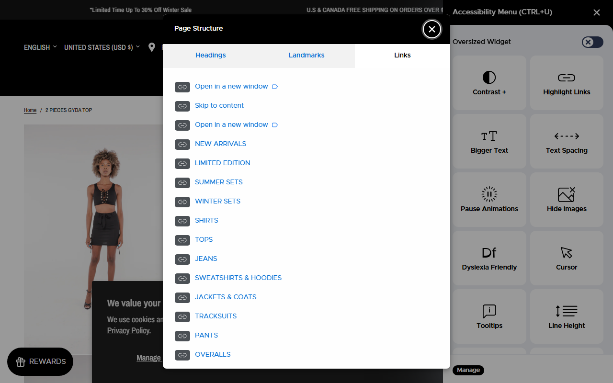 | **Carbon:** 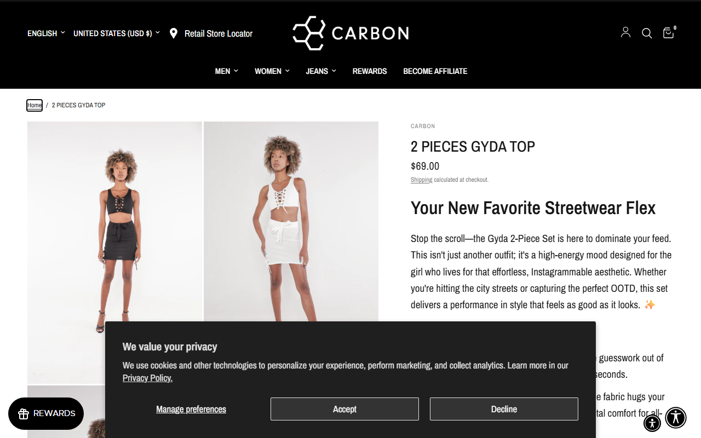 |

**Similar ≠ same:** Same intent (first/managed link focus). **Which link fires first** can differ by DOM order.

---

### After reset (+ Carbon panel state)

| UserWay (this feature) | Carbon Assist (closest) |
|--------------------------|---------------------------|
| **UserWay:**  | **Carbon:**  |

**Similar ≠ same:** UserWay: **resetAll + widgetClose**. Carbon: **reset footer + clear preset** (panel may still be open in test). Compare **page** return to baseline, not panel chrome.

---

## Regenerate

```bash
node scripts/run-a11y-widget-storefront-report-full.mjs
node scripts/run-userway-storefront-report.mjs
node scripts/generate-userway-vs-carbon-comparison.mjs
```
