# Carbon Assist widget — production verification (MCP / Playwright)

**Date:** 2026-03-27  
**Scope:** Deep check on **shopcarbon.com** (storefront) and **app.shopcarbon.com/accessibility** (studio), with screenshots for contrast modes and sync notes.

---

## 1. Deploy / bundle sanity (CLI)

`node tmp/check-widget-deploy.mjs` against production reported:

| Check | Result |
|--------|--------|
| `__caRev` in served JS | **126** |
| `docRoot.appendChild(wrap)` | **true** (HTML host) |
| Invert implementation | **`body{filter`** (not legacy `html{filter`) |

---

## 2. shopcarbon.com (storefront)

### 2.1 Runtime probes (Playwright)

| Probe | Mobile (390×844) | Desktop (~1360×820) |
|--------|------------------|----------------------|
| `window.__carbonA11yRev` | **126** | **126** |
| Host element | `HTML` | `HTML` |
| After contrast reset to **None** | `body` filter **none** | — |
| With **Invert** selected | — | `body` filter **`invert(1)`** |

### 2.2 Theme script URL vs actual bundle

The live page’s widget `<script src="…">` still includes **`wrev=119`** in the query string:

`https://app.shopcarbon.com/accessibility/widget?scope=default&wrev=119`

A separate **fetch** of that exact URL shows the response body still contains **`__caRev=126`** (server is not pinned to 119). So **behavior matches the deployed app** even though the theme’s cache-buster param is stale.

**Recommendation:** Update the Shopify theme snippet to **`wrev=126`** (or your current rev) so the URL matches reality and any intermediate caches behave predictably.

### 2.3 Console / network (non-blocking)

Repeated **CORS / failed** requests to `https://app.shopcarbon.com/api/accessibility/usage` from the storefront origin. The widget UI still loaded and contrast modes worked; fixing CORS (or proxying usage) would clean console noise.

### 2.4 Screenshots — mobile

| # | File | Description |
|---|------|-------------|
| 1 | `shopcarbon-mobile-01-home-closed.png` | Home, launcher closed |
| 2 | `shopcarbon-mobile-02-panel-open.png` | Panel open |
| 3 | `shopcarbon-mobile-03-contrast-none.png` | Contrast: **None** |
| 4 | `shopcarbon-mobile-03-contrast-dark.png` | Contrast: **Dark** |
| 5 | `shopcarbon-mobile-03-contrast-light.png` | Contrast: **Light** |
| 6 | `shopcarbon-mobile-03-contrast-invert.png` | Contrast: **Invert** |
| 7 | `shopcarbon-mobile-03-contrast-smart.png` | Contrast: **Smart** |
| 8 | `shopcarbon-mobile-04-contrast-reset-none.png` | Reset to **None** |

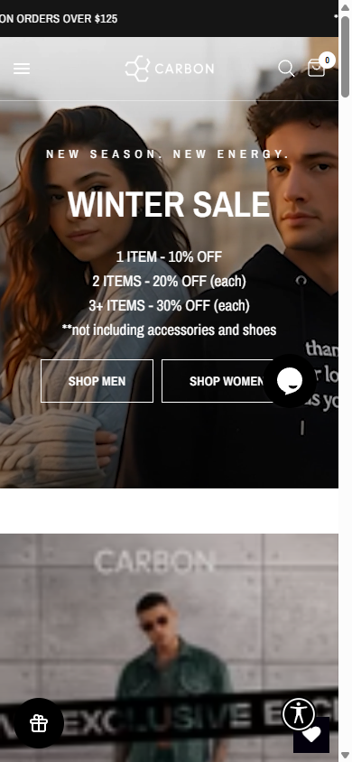

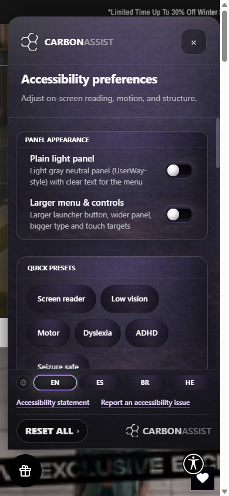

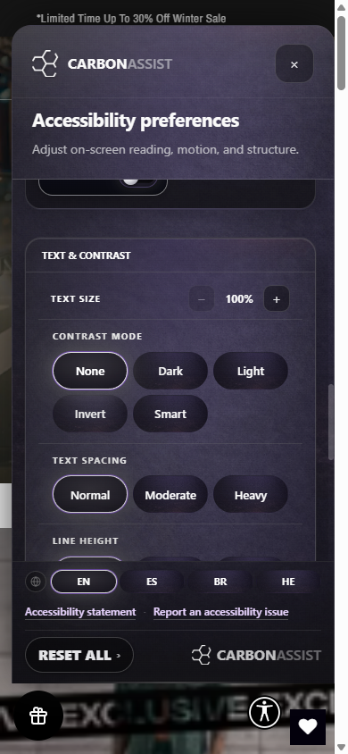

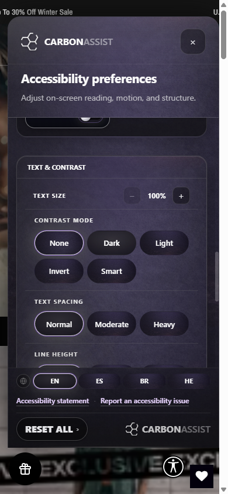

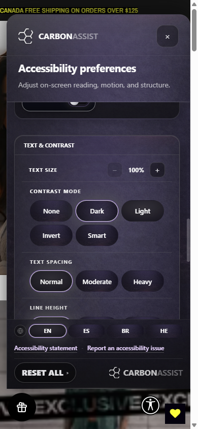

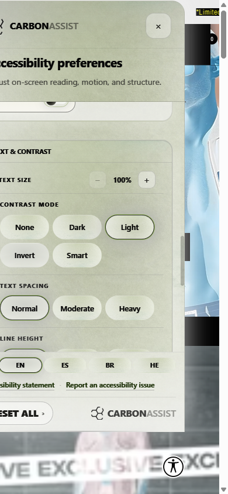

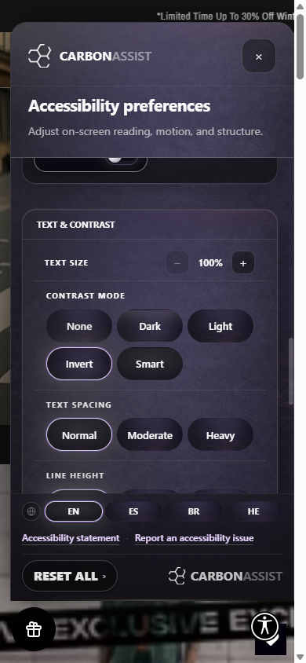

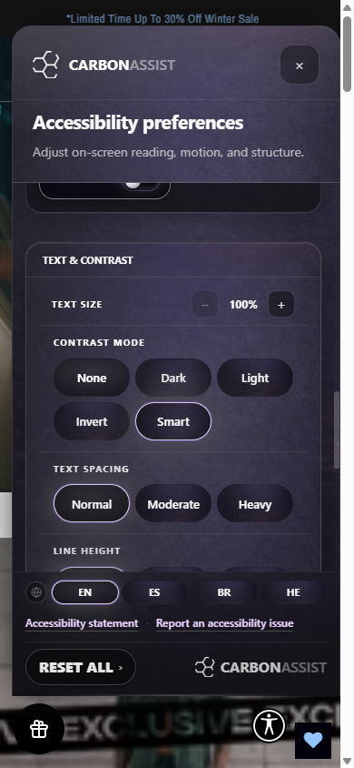

### 2.5 Screenshots — desktop

| # | File | Description |
|---|------|-------------|
| 1 | `shopcarbon-desktop-01-home-closed.png` | Home, launcher closed |
| 2 | `shopcarbon-desktop-02-panel-open.png` | Panel open |
| 3 | `shopcarbon-desktop-03-invert.png` | Contrast: **Invert** |
| 4 | `shopcarbon-desktop-04-reset-none.png` | Reset to **None** |

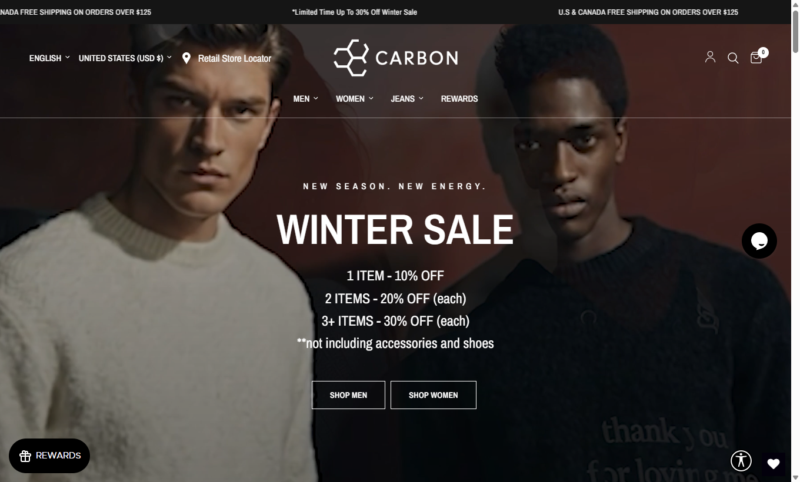

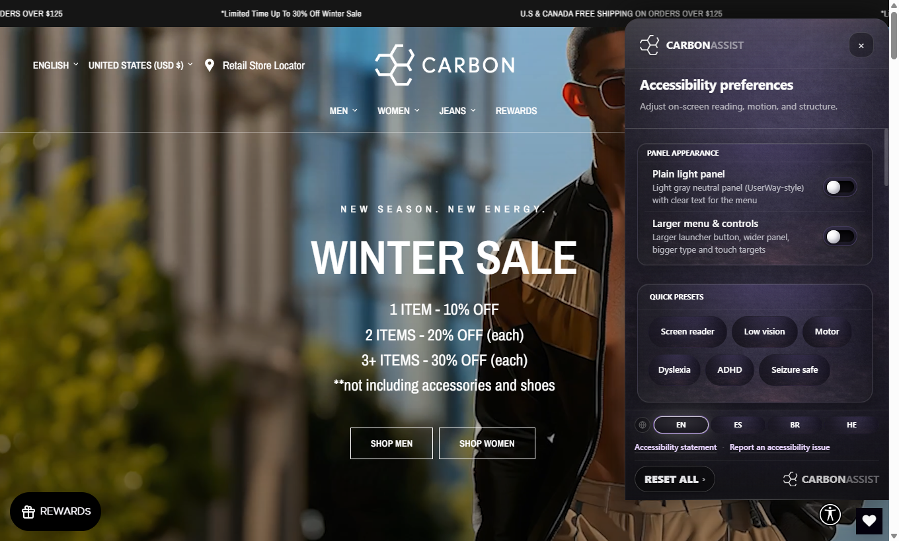

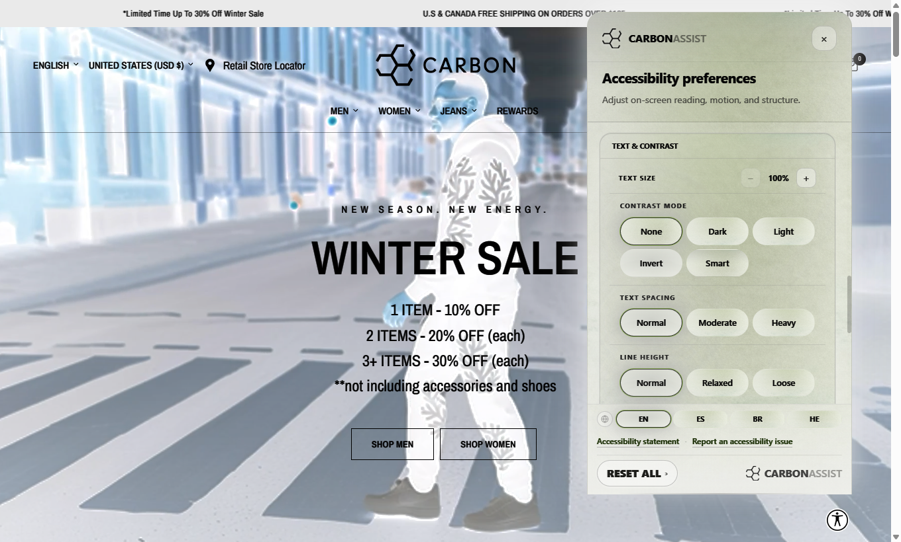

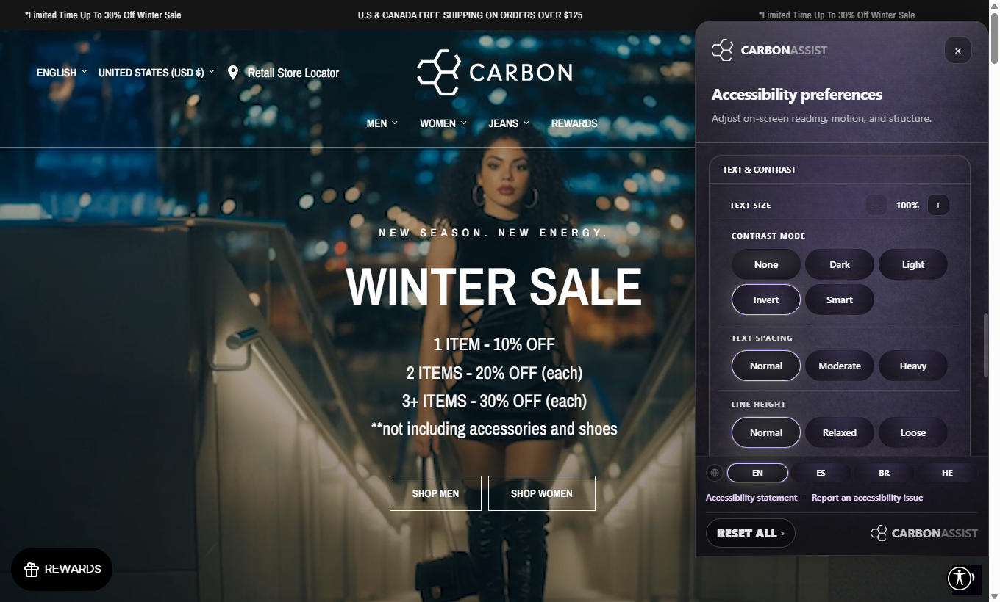

**Note:** Desktop run focused on home → panel → **Invert** (with `body` filter probe) → reset. Mobile run covered **all** contrast radio options.

---

## 3. app.shopcarbon.com (studio / accessibility)

### 3.1 Page screenshot

| File | Description |
|------|-------------|
| `app-shopcarbon-accessibility-01-viewport.png` | `/accessibility` viewport (logged-in session in MCP) |

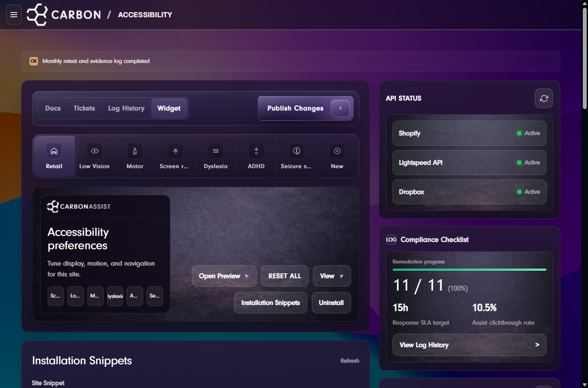

### 3.2 Bundle sync with storefront

| Check | Result |
|--------|--------|
| In-page `fetch` of `…/accessibility/widget?scope=default&wrev=126&…` | Response contains **`__caRev=126`** |
| Plain visible page text | Did not surface `wrev=126` in copied `innerText` (UI/shell); **API fetch confirms rev** |

---

## 4. Sync summary

| Item | Status |
|------|--------|
| Served widget JS revision | **126** on both CLI check and in-browser fetch |
| Storefront runtime `__carbonA11yRev` | **126** |
| Install script query `wrev` on live HTML | Still **119** — **cosmetic/cache-buster drift**; response body is **126** |
| Invert on `body` + HTML host | **Confirmed** on production |

---

## 5. Artifacts

All PNGs and this report live in:

`reports/widget-verification-mcp-2026-03-27/`
